### Get the Book

## Table of Contents

 -  [Screenshots](#screenshots)
 -  [Summary](#Summary)
 -  [Technologies Used](#technologies-used)

#### Screenshots
1.  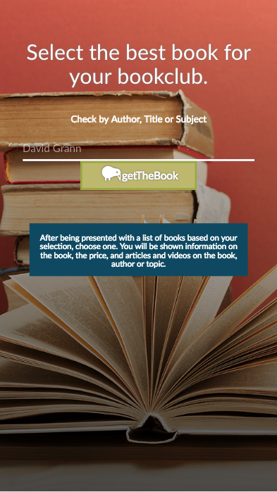
2.  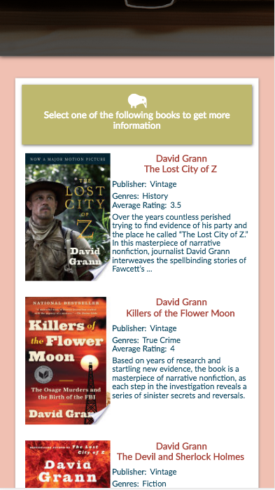
3.  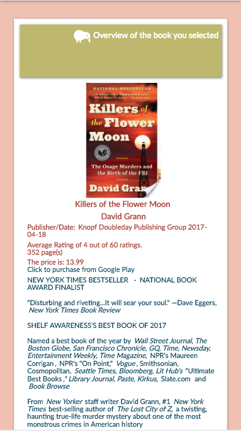
4.  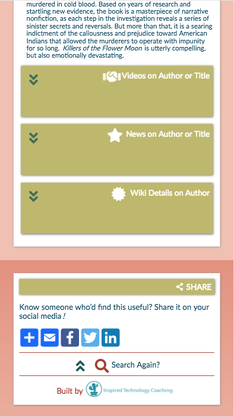
5.  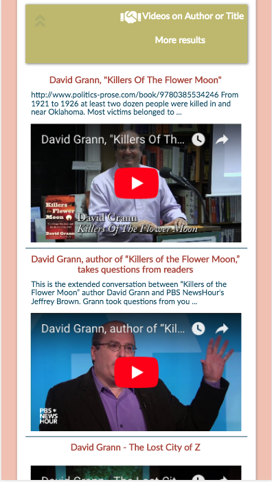
6.  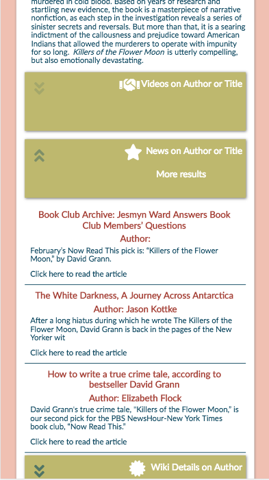
7.  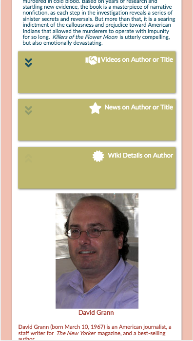

1.  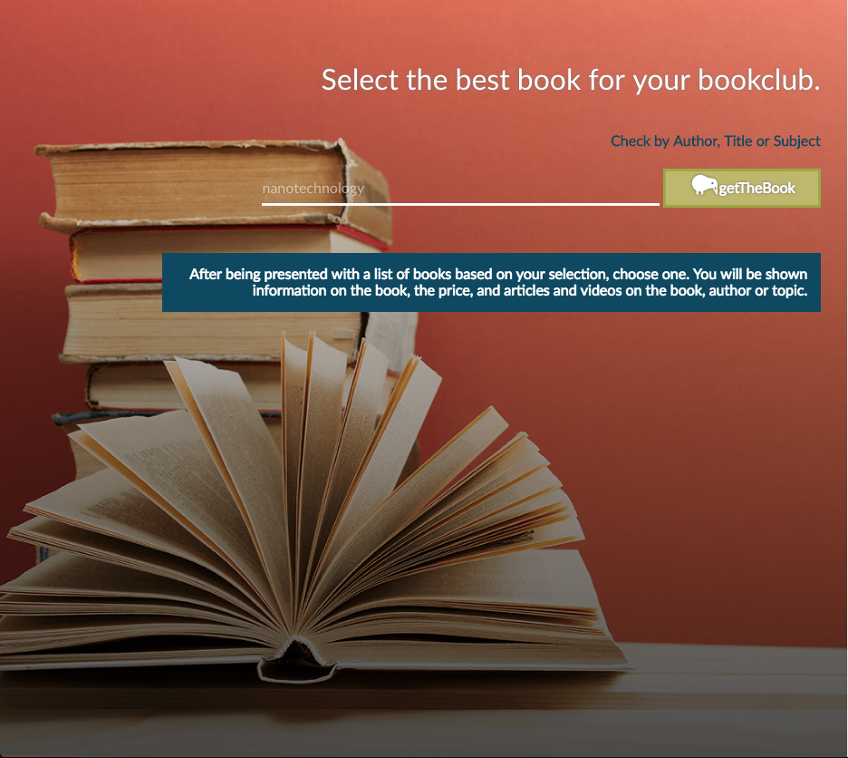
2.  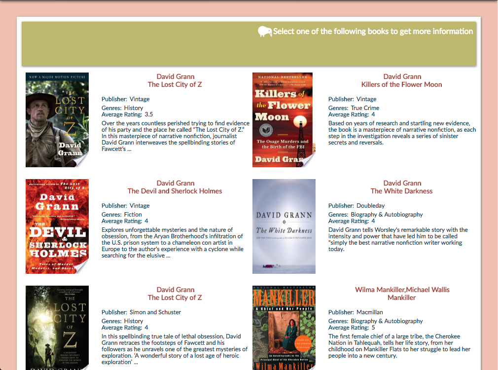
3.  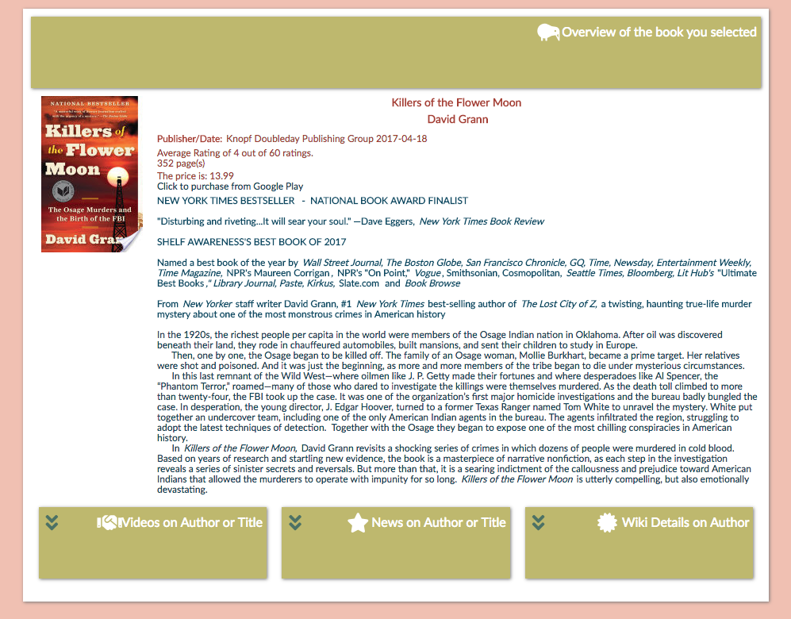
4.  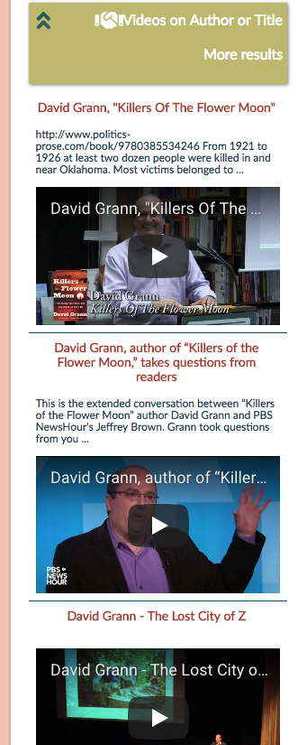
5.  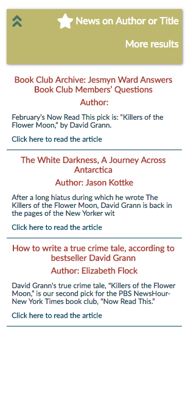
6.  
7.  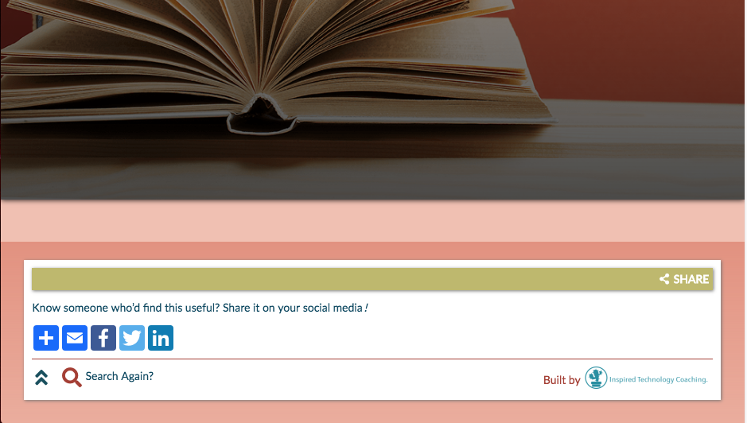

#### Summary

getTheBook was developed in order to have multiple sources of data available to members of book clubs as they chose the next book or books to read for their group.  A user may type an author, title, topic or any other word into the search field they are presented with on linking to the app.  The user may click enter or the 'getTheBook' button.  The next screen they are presented with is a listing of the top 10 books that are associated with the search term.  The user can peruse initial information here, including ratings, publisher and a short synopsis.  Once they click on a book to look at they are interested in, they are brought to a screen with more extensive information on the book, including a lengthier summary and details on purchasing the book through Google Play.  If the book is available for purchase through Google Play, the user may click on that link and a new tab will open in Google Play and the user may make their purchase.

There are three other options at the bottom of the 'selected book' screen that the user may select to gain more context on the book and/or author.  If s/he clicks on the Videos blinking down arrow, s/he can see the first 10 videos that concern either the author or the title of the book.  These come from the Youtube API.  If s/he clicks on the News blinking down arrown, s/he can see articles written about the book or author.  These come from the News API.  In both of these cases, the user may select two other options.  S/he may click the 'More Results' words and get the next grouping of results.  Alternatively, s/he can click the blinking up arrow button and close the information window.  The third option is 'Wiki Details.'  If the user clicks on this blinking down arrow, information (the first 2500 characters) on the author will be presented in the drop down box, including a picture.  If the user wishes to look at the full Wikipedia article, they can click on that option at the bottom of the dropdown and a new tab will open with Wikipedia at the location for the selected author.

Finally, the footer of the app offers the opportunity for the user to share the app by clicking on a button to share in their selected format.  The user may also go to Inspired Technology Coaching through that link.

#### Technologies Used
HTML, CSS, Javascript,JQuery
Data sources are APIs from News Youtube and Wikipedia
